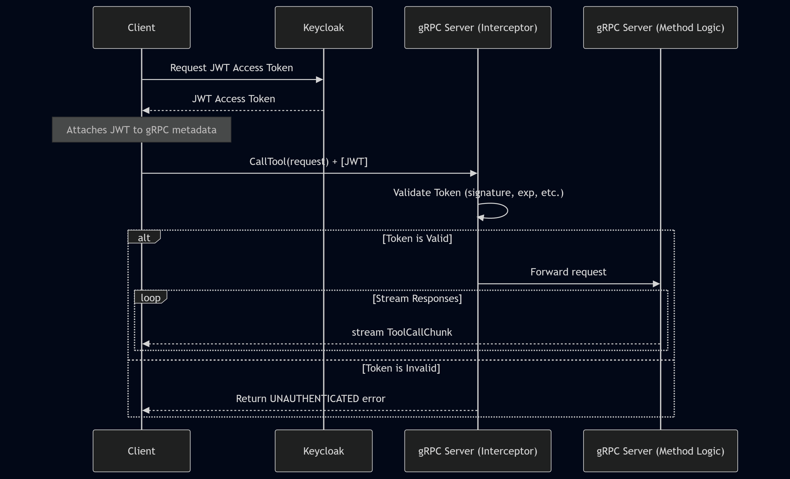

## Design Document: ModuleContextStreaming (MCS)

**Version:** 0.0.2

**Date:** October 1, 2025

**Author:** Sam Armstrong

-----

### 1. Overview

The **ModuleContextStreaming (MCS)** project is a high-performance client-server application designed to provide rich, real-time context to Large Language Models (LLMs). The core feature is the ability to securely stream data from server-side tools directly to a client, enabling more dynamic and interactive AI applications.

The system is built on a modern, cloud-native stack to ensure scalability, security, and performance. A key architectural feature is its ability to act as a unified gateway by integrating with external tool backends, such as those implementing the **Model Context Protocol (MCP)**.

-----

### 2. Core Architecture

  * **Protocol: gRPC**
      * We are using gRPC as the communication protocol. It operates over HTTP/2, providing high-performance, bidirectional streaming, and a low-latency connection ideal for our streaming-first requirements.
  * **Schema Definition: Protocol Buffers (Protobuf)**
      * The API contract—all services, methods, and data structures—is formally defined in the `protos/mcs.proto` file. This file is the **single source of truth** for the API, allowing for the generation of type-safe client and server code.
  * **Authentication: Keycloak (IAM) with JWTs**
      * Security is handled via the OAuth 2.0 / OIDC standard. The server acts as a resource server that validates JWT access tokens issued by a central Keycloak instance, ensuring that every request is authenticated.

-----

### 3. Component Breakdown

  * **`protos/mcs.proto`:** The API contract. Defines the `ModuleContext` service, its RPC methods (`ListTools`, `CallTool`), and all message types, including the `ToolCallChunk` which uses a `oneof` field for streaming heterogeneous content (text, images, etc.).
  * **Generated Code (`mcs_pb2.py`, `mcs_pb2_grpc.py`):** These files are automatically generated from the `.proto` file. They contain the Python classes for all messages and the necessary base classes and stubs for the server and client. **Do not edit these files by hand.**
  * **`server.py`:** Contains the main `Server` logic. It implements the `ModuleContextServicer`, manages the tool registry, and handles security. Crucially, it contains the `MCPToolAdapter`, which connects to and exposes tools from external MCP backends.
  * **`client.py`:** Contains the `Client` logic. It uses the generated `ModuleContextStub` to connect to the server and make RPC calls. It handles the Keycloak authentication flow and includes the `MCPContentParser` to intelligently parse and categorize mixed-media responses from MCP tools.
  * **`auth.py`:** This module is responsible for handling all security-related logic.
      * It contains the `KeycloakAuthenticator` for validating JWTs against Keycloak's public keys.
      * It implements a **gRPC Interceptor**, which acts as middleware to check the credentials of every incoming request before it reaches the service logic.
  * **Configuration (`.env` files):** The server and client are configured via environment variables, promoting a clean separation of configuration from code, which is ideal for portability and security.

-----

### 4. Key Design Patterns

  * **Adapter Pattern for MCP:** The `MCPToolAdapter` is a classic adapter. It wraps an MCP `ClientSession` and adapts its interface to be compatible with the MCS `tool_registry`. This powerful pattern allows the server to treat native Python tools and external MCP tools uniformly, making the system highly extensible.
  * **Interceptor for Cross-Cutting Concerns:** Using a gRPC Interceptor for authentication is a deliberate choice to handle a "cross-cutting concern." It keeps the security logic completely separate from the business logic in the RPC methods, making the code cleaner and easier to maintain.
  * **Streaming-First API:** The `CallTool` RPC is a server-streaming method. This is a fundamental design decision that allows the server to send back results as they become available. This is critical for LLM applications, as it provides low-latency feedback and efficiently handles tools that produce large or slow-generating outputs.

-----

### 5. Authentication & Authorization Flow

The system uses a stateless, token-based authentication model.

1.  **Token Acquisition:** The client application is responsible for authenticating with Keycloak (using the client credentials flow) and obtaining a valid JWT access token.
2.  **Token Presentation:** The client attaches this JWT to the **metadata** of every outgoing gRPC call in an `authorization` header.
3.  **Token Validation (Server-Side Interceptor):**
      * An interceptor on the gRPC server catches every incoming call.
      * It extracts the JWT from the call's metadata.
      * It uses the `KeycloakAuthenticator` to validate the token's signature, expiration, issuer (`iss`), and audience (`aud`).
      * If the token is invalid, the interceptor immediately rejects the call with an `UNAUTHENTICATED` status code.
      * If the token is valid, the interceptor allows the call to proceed to the actual RPC method implementation.
4.  **Authorization:** Inside the RPC method implementation, the code can inspect claims from the token (a future enhancement) to determine if the authenticated client has the necessary permissions to use a specific tool. If not, it can return a `PERMISSION_DENIED` status.

-----

### 6. Sequence Diagram: Authenticated Streaming Call

Here is the typical flow for a client making a secure, streaming tool call.

