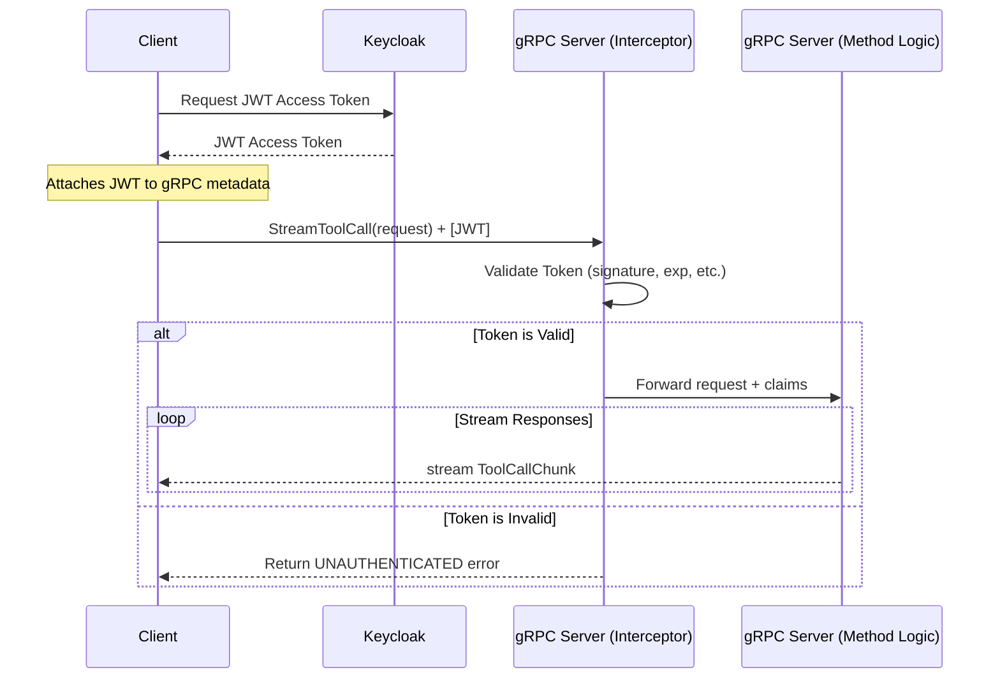

## Design Document: ModuleContextStreaming (MCS)

**Version:** 0.0.1

**Date:** September 26, 2025

**Author:** Sam Armstrong

-----

### 1. Overview

The **ModuleContextStreaming (MCS)** project is a high-performance client-server application designed to provide rich, real-time context to Large Language Models (LLMs). The core feature is the ability to securely stream data from server-side tools and resources directly to a client, enabling more dynamic and interactive AI applications.

The system is built on a modern, cloud-native stack to ensure scalability, security, and performance.

-----

### 2. Core Architecture

  * **Protocol:** **gRPC**
      * We are using gRPC as the communication protocol. It operates over HTTP/2, providing high-performance, bidirectional streaming, and a low-latency connection. This is ideal for our streaming-first requirements.
  * **Schema Definition:** **Protocol Buffers (Protobuf)**
      * The API contract—all services, methods, and data structures—is formally defined in the `protos/mcs.proto` file. This file is the **single source of truth** for the API. Code for clients and servers is generated directly from it, eliminating guesswork and ensuring consistency.
  * **Authentication:** **Keycloak (IAM) with JWTs**
      * Security is handled via the OAuth 2.0 / OIDC standard. The server will be a resource server that validates JWT access tokens issued by a central Keycloak instance.

-----

### 3. Component Breakdown

  * **`protos/mcs.proto`:** The API contract. Defines the `ModuleContext` service, its RPC methods, and all message types.
  * **Generated Code (`mcs_pb2.py`, `mcs_pb2_grpc.py`):** These files are automatically generated from the `.proto` file. They contain the Python classes for all messages and the necessary base classes and stubs for the server and client. **Do not edit these files by hand.**
  * **`server.py`:** Contains the main server logic. It implements the `ModuleContextServicer` class generated by gRPC. This is where the core functionality of your RPC methods (e.g., what happens when a tool is called) will live.
  * **`client.py`:** Contains the client-side logic. It uses the generated `ModuleContextStub` to connect to the server and make RPC calls. It provides a clean interface for an application to interact with the server.
  * **`auth.py`:** This module is responsible for handling all security-related logic.
      * It contains the `KeycloakAuthenticator` class for validating JWTs.
      * It will be used to implement a **gRPC Interceptor** on the server, which is a middleware that checks the credentials of every incoming request before it reaches your main service logic.

-----

### 4. Authentication & Authorization Flow

The system uses a stateless, token-based authentication model.

1.  **Token Acquisition:** The client application is responsible for authenticating with Keycloak and obtaining a valid JWT access token.
2.  **Token Presentation:** The client attaches this JWT to the **metadata** of every outgoing gRPC call.
3.  **Token Validation (Server-Side Interceptor):**
      * An interceptor on the gRPC server catches every incoming call.
      * It extracts the JWT from the call's metadata.
      * It uses the `KeycloakAuthenticator` to validate the token's signature, expiration, issuer (`iss`), and audience (`aud`).
      * If the token is invalid, the interceptor immediately rejects the call with an `UNAUTHENTICATED` status code.
      * If the token is valid, the interceptor allows the call to proceed to the actual RPC method implementation in `server.py`. The decoded token claims (e.g., user roles) can be added to the call's context for use in authorization.
4.  **Authorization:** Inside the RPC method implementation (e.g., `StreamToolCall`), the code can inspect the claims passed from the interceptor to determine if the authenticated user or client has the necessary permissions to perform the requested action. If not, it can return a `PERMISSION_DENIED` status.

-----

### 5. Sequence Diagram: Authenticated Streaming Call

Here is the typical flow for a client making a secure, streaming tool call.

