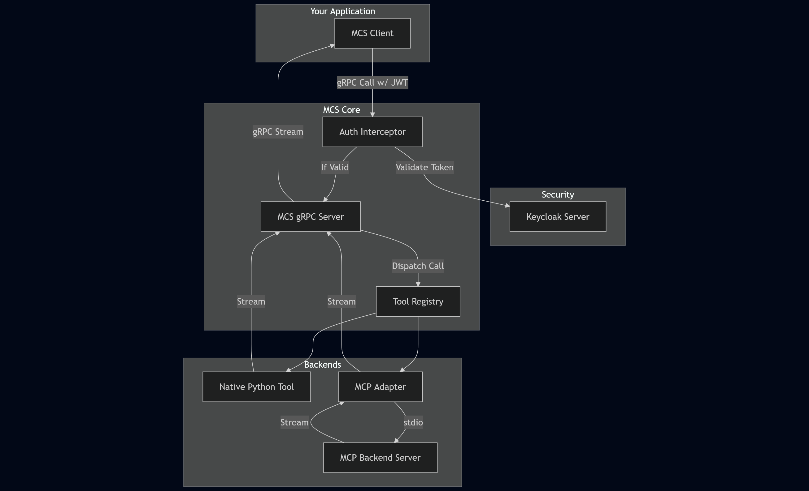

# ModuleContextStreaming (MCS) 🚀

<p align="center">
  <a href="https://pypi.org/project/ModuleContextStreaming/"></a>
  <a href="#"></a>
  <a href="#"></a>
  <a href="https://opensource.org/licenses/MIT"></a>
  <a href="#"></a>
</p>

A high-performance gRPC service designed to provide real-time, streamable context to Large Language Models (LLMs). This project serves as a robust backend for AI applications that require secure, low-latency communication with server-side tools and resources.

It features a secure, authenticated API and a powerful adapter for integrating with **Model Context Protocol (MCP)** servers, allowing you to expose tools from any MCP-compatible backend through a single, unified gRPC interface.

-----

## Why Use MCS?

* **Solve LLM Latency:** Traditional REST APIs can be slow for conversational AI. MCS uses gRPC streaming to send data back to the LLM *as it's generated*, creating a more responsive user experience.
* **Unify Your Tools:** Stop building one-off backends. MCS can act as a secure gateway to all your tools, whether they are native Python functions or external **Model Context Protocol (MCP)** servers.
* **Secure by Default:** Don't worry about boilerplate security code. MCS provides out-of-the-box JWT authentication via Keycloak and enforces TLS encryption.
* **Type-Safe & Reliable:** By using a Protobuf schema, you eliminate entire classes of bugs. The API contract is clear, versionable, and reliable.

-----
## High-Level Architecture


-----

## Features

  * **High-Performance Streaming:** Built on gRPC and HTTP/2 for efficient, multiplexed, and low-latency data streaming.
  * **Strict API Contract:** Uses Protocol Buffers (`.proto`) as the single source of truth for the API, ensuring type-safe communication.
  * **Secure by Default:**
      * **JWT Authentication:** Integrates with Keycloak for robust, token-based authentication using a gRPC interceptor.
      * **TLS Encryption:** Supports secure gRPC channels out-of-the-box for encrypted client-server communication.
  * **MCP Backend Integration:** Seamlessly connect to and expose tools from MCP servers running over stdio.
  * **Intelligent Client:** Includes an MCP-aware parser that can automatically distinguish between text, images, structured JSON, resources, and errors from tool responses.
  * **Configurable & Extensible:** The server and client are configured via environment variables (`.env` file) and the server's `Tool Registry` makes it simple to add new native Python tools.

-----

## Project Structure

```
ModuleContextStreaming/         # The project root directory
├── ModuleContextStreaming/     # The main, installable Python package
│   ├── init.py
│   ├── server.py             # Reusable gRPC Server class with MCP adapter
│   ├── client.py             # Reusable gRPC Client class with MCP parser
│   ├── auth.py               # Keycloak JWT authentication interceptor
│   ├── exceptions.py         # Custom exception types
│   ├── mcs_pb2.py            # Generated Protobuf messages
│   └── mcs_pb2_grpc.py       # Generated gRPC client/server stubs
├── protos/
│   └── mcs.proto             # The API contract source of truth
├── examples/
│   ├── simple_server.py      # Example runnable server with native tools
│   └── simple_client.py      # Example runnable client
├── certs/
│   ├── private.key           # Placeholder for your TLS private key
│   └── certificate.pem       # Placeholder for your TLS certificate
├── build_scripts.py          # Script to generate and patch gRPC code
├── DESIGN.md                 # Project architecture and design decisions
├── pyproject.toml            # Project metadata and dependencies
└── README.md
```

-----

## Setup and Installation

### Prerequisites

  * Python 3.10+
  * Git
  * (Optional) OpenSSL - for self-signed certificates

### Installation Steps

1.  **Clone the repository:**

    ```bash
    git clone [https://github.com/armstrongsam25/ModuleContextStreaming.git](https://github.com/armstrongsam25/ModuleContextStreaming.git)
    cd ModuleContextStreaming
    ```

2.  **Create and activate a virtual environment:**

    ```bash
    python -m venv .venv
    
    # On Windows: 
    .\.venv\Scripts\activate
    
    # On macOS/Linux: 
    source .venv/bin/activate
    ```

3.  **Install dependencies:**
    This installs the project in editable mode (`-e`) along with all development dependencies.

    ```bash
    pip install -e .[dev]
    ```

4.  **Generate gRPC Code:**
    Run these commands to compile the `.proto` file and apply the necessary import patch. You only need to re-run this when `protos/mcs.proto` changes.

    ```bash
    # 1. Generate gRPC code from the .proto file
    python -m grpc_tools.protoc -I ./protos --python_out=./ModuleContextStreaming --grpc_python_out=./ModuleContextStreaming ./protos/mcs.proto

    # 2. Patch the generated code for correct relative imports
    python build_scripts/build.py
    ```

5.  **Generate Self-Signed Certificates (for local testing):**

    ```bash
    openssl req -x509 -newkey rsa:4096 -keyout certs/private.key -out certs/certificate.pem -sha256 -days 365 -nodes -subj "/CN=localhost"
    ```

-----

## Usage

1.  **Configure your environment:** Copy `.env.example` to `.env` and fill in your Keycloak details.
2.  **Start the Server:** In your first terminal, run:
    ```bash
    python examples/simple_server.py
    ```
3.  **Run the Client:** In a second terminal, run:
    ```bash
    python examples/simple_client.py
    ```

-----

## Contributing

Contributions are welcome\! Please feel free to open an issue to report a bug or request a feature, or submit a pull request.

-----

## Roadmap

  * **Advanced Authorization:** Implement role-based access control (RBAC) based on JWT claims.
  * **TCP-based MCP Backends:** Extend the `MCPToolAdapter` to support TCP sockets.
  * **Enhanced Observability:** Integrate structured logging and OpenTelemetry.
  * **Comprehensive Testing:** Add a full suite of unit and integration tests.
  * **PyPI Packaging:** Finalize packaging and publish to PyPI.

-----

## License

Distributed under the [MIT License](LICENSE.md).
